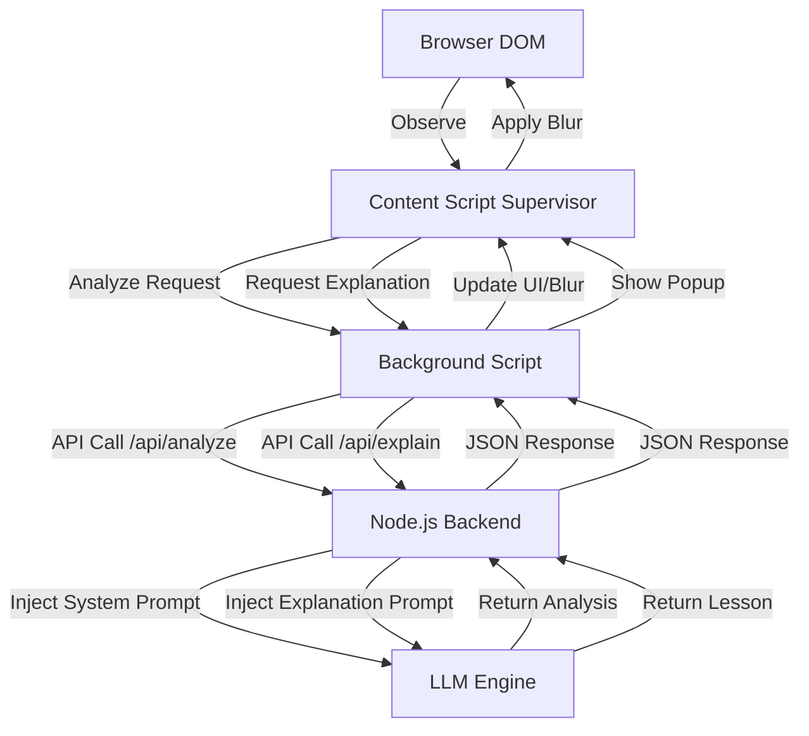
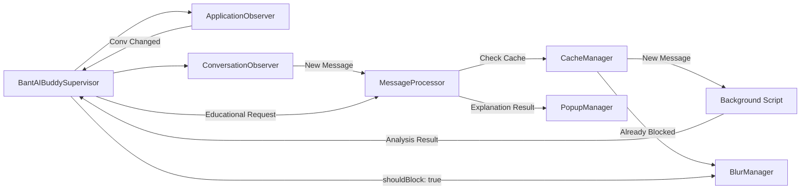

# BantAI Buddy Extension 1.0.0

BantAI Buddy is an intelligent browser extension designed to enhance user interaction and provide real-time content analysis through a sophisticated AI-powered pipeline. It integrates a lightweight Chrome extension with a robust Node.js backend to deliver seamless AI assistance and content moderation directly within the browser.

## Visuals

<p align="center">
  
</p>

## Architecture Overview

The project utilizes a **Client-Server Architecture** designed for low-latency processing and scalable AI orchestration.

- **Client (Chrome Extension)**: A Manifest V3 extension that handles DOM observation, real-time content filtering, and the user interface.
- **Backend (Node.js/Express)**: A central orchestration layer that manages prompt injection, AI model communication, and response structuring.
- **AI Pipeline**: A modular prompt-driven system that transforms raw browser content into structured analysis and educational explanations.

### System Pipeline
The system follows a cyclical flow of observation, analysis, and action.



## Key Features

- **Real-time Content Observation**: High-performance observers (`ApplicationObserver`, `ConversationObserver`) that monitor DOM changes with minimal overhead.
- **Intelligent Content Filtering**: Automatic blurring of content that violates safety or policy guidelines based on AI analysis.
- **Educational Explanations**: Instead of simple blocking, the system provides "learning moments" through an explanation engine.
- **Safety Regression Suite**: A Python-based framework to validate AI responses against a golden dataset, ensuring consistency and safety.
- **Persistent Caching**: A robust caching mechanism that survives page and extension reloads, significantly reducing redundant API calls and improving response times.

## Technical Deep Dive

### AI Moderation Pipeline
The moderation pipeline is driven by a strict **System Prompt** (`system-prompt.txt`). When a message is analyzed:
1. The backend wraps the user content in a system prompt that defines safety boundaries.
2. The LLM is required to return a structured JSON response containing:
   - `shouldBlock`: A boolean indicating if the content violates guidelines.
   - `analysis`: A detailed reasoning for the decision.
3. The extension receives this result and immediately invokes the `BlurManager` if `shouldBlock` is true.

### Browser Extension Flow
The extension operates under a supervisor pattern to maintain state and coordinate asynchronous AI requests.



### Backend APIs
The backend exposes a RESTful API for the extension:

| Endpoint | Method | Description | Input | Output |
| :--- | :--- | :--- | :--- | :--- |
| `/api/analyze` | `POST` | Analyzes content for violations | `text` | `{ shouldBlock, analysis }` |
| `/api/explain` | `POST` | Generates an educational lesson | `text, analysis` | `{ childComment, explanation }` |
| `/api/health` | `GET` | System health and LLM connectivity | N/A | `{ status, llmConnected }` |

### Core AI Engines
- **Local LLM Integration**: The backend is configured to support local LLM providers (via `.env` settings), reducing latency and increasing privacy by processing data on the user's local network or a dedicated server.
- **Explanation Engine**: When a user requests to see why a message was blocked, the `Explanation Engine` uses `explanation-prompt.txt` to re-process the original violation and the analysis into a constructive, educational response.

## Project Structure

```text
.
├── bantAI-backend/                # Backend Server
│   ├── api/                       # Express API endpoints (analyze, health)
│   ├── datasets/                  # Data for training or testing
│   ├── prompts/                   # AI System and Explanation prompts
│   ├── scripts/                   # Utility scripts (health-check, env-validation)
│   ├── tests/                     # Regression and safety testing suite
│   │   └── regression/            # Python-based regression framework
│   └── package.json               # Backend dependencies and scripts
└── bantAIbuddy-chrome-extension/  # Chrome Extension
    ├── assets/                    # CSS styles and static assets
    ├── content-scripts/           # DOM observers and processors
    ├── ui/                        # Extension User Interface
    │   ├── onboarding/            # Setup and activation pages
    │   ├── shared/                # Shared styles and animations
    │   └── view/                  # Main popup view
    ├── background.js              # Extension background service worker
    └── manifest.json              # Extension configuration
```

## Technology Stack

| Component | Technology |
| :--- | :--- |
| **Backend** | Node.js, Express |
| **Frontend/Extension** | JavaScript (ES6+), HTML5, CSS3, Chrome Manifest V3 |
| **Testing** | Python 3, JSON |
| **AI Integration** | LLM (Local/Remote API) |
| **Environment** | Windows 11, VS Code |

## Installation & Setup

### 1. Backend Setup
1. Navigate to the backend directory:
   ```bash
   cd bantAI-backend
   ```
2. Install dependencies:
   ```bash
   npm install
   ```
3. **Configure Environment**: 
   - Copy `.env.example` to `.env`.
   - Add your LLM API keys or local endpoint URLs.
4. Start the server:
   ```bash
   npm start
   ```

### 2. Local LLM Integration (Optional)
To run the AI pipeline locally:
- Install a local LLM provider (e.g., Ollama).
- Update the `.env` file to point to the local endpoint (e.g., `LLM_API_URL=http://localhost:11434/api/generate`).
- Ensure the model specified in the backend matches the model downloaded locally.

### 3. Extension Installation
1. Open Chrome and navigate to `chrome://extensions/`.
2. Enable **Developer mode** (top right toggle).
3. Click **Load unpacked** and select the `bantAIbuddy-chrome-extension` folder.

### 4. Running Safety Regression Tests
The safety suite ensures AI responses remain within policy boundaries:
1. Navigate to the backend scripts:
   ```bash
   cd bantAI-backend
   ```
2. Run the Python regression script:
   ```bash
   python scripts/run-safety-regression.py
   ```
3. Review the generated report for any assertion failures in `safety-regression-messenger.json`.

## Testing & Validation

- **Environment Validation**: `node scripts/validate-env.js` — Verifies all required keys in `.env`.
- **Health Check**: `node scripts/health-check.js` — Verifies API and LLM connectivity.
- **Safety Regression**: `python scripts/run-safety-regression.py` — Validates AI output against the safety dataset.

## Known Limitations & Future Improvements

### Known Limitations
- **DOM Volatility**: High-frequency updates in certain web applications may occasionally trigger redundant analysis requests.
- **LLM Latency**: Real-time blurring is dependent on LLM response time; significant delays may result in a brief "flash" of unblurred content.

### Future Improvements
- [ ] **Multi-Platform Support**: Expand observers to support more messaging platforms.
- [ ] **Smart Dictionary Fallback (Graceful Degradation)**: Implement a fallback system to ensure the extension remains functional and provides a "safe-pass" experience during LLM downtime.
- [ ] **Customizable Rules**: Allow users to define their own "blocking" keywords via the extension popup.

## Screenshots
*(Placeholders for future implementation)*
- `[Screenshot: Onboarding Process]`
- `[Screenshot: Content Blurring in Action]`
- `[Screenshot: Educational Popup]`

## Contributors
- **Angela Jahziel Encabo**
- **Arth Andrey Endrina**
- **Aissha Monceda**
- **Gerald Benedict Ares**
- **Ycany Ashra Sanchez**
